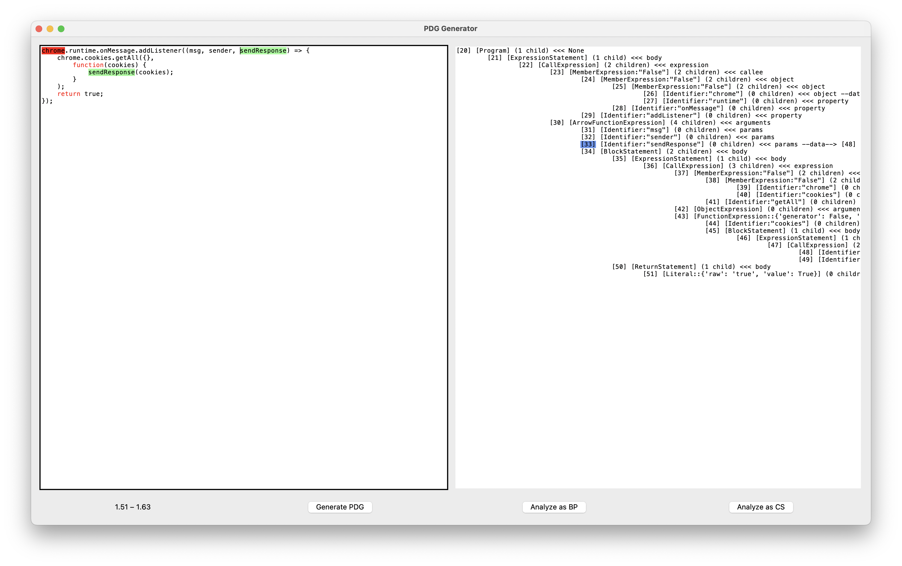
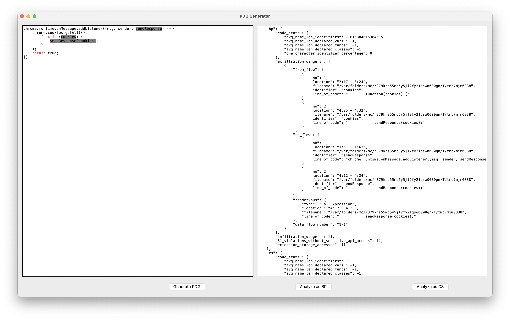

# Automated Detection of Site Isolation Bypass Vulnerabilities in Browser Extensions

This is a JavaScript static analysis tool for finding renderer-attacker-exploitable site-isolation-bypass 
vulnerabilities in Chrome extensions, loosely based on a static analysis tool called *DoubleX* by 
Aurore Fass et al. ([GitHub here](https://github.com/Aurore54F/DoubleX), 
[paper here](https://swag.cispa.saarland/papers/fass2021doublex.pdf)).

It has been developed in 2024 by Kendrick Grünberg (B.Sc.) as a 3-month / 15 ECTS project work 
@ [the Institute for Application Security (IAS), TU Braunschweig](https://www.tu-braunschweig.de/ias/), 
under the supervision of [Jan Niklas Drescher](https://github.com/jndre).

## Types of vulnerabilities detected

This tool is intended to detect vulnerabilities in Chrome extensions exploitable by a web renderer attacker, as 
described and discussed in 
[this 2023 paper by Young Min Kim and Byoungyoung Lee](https://www.usenix.org/conference/usenixsecurity23/presentation/kim-young-min).

They consider 3 types of vulnerabilities:
1. type 4.1 vulnerabilities: the execution of privileged browser APIs (resulting in data exfiltration or UXSS)
2. type 4.2 vulnerabilities: writing sensitive extension data (resulting in UXSS)
3. type 4.3 vulnerabilities: reading sensitive extension data (resulting in data exfiltration)

This tool will detect a vulnerability in the following service worker (under MV2 known as a *background page*) code, 
for example:

```javascript
chrome.runtime.onMessage.addListener((msg, sender, sendResponse) => {
    chrome.cookies.getAll({},
        function(cookies) {
            sendResponse(cookies);
        }
    );
    return true;
});
```

This tool will detect two data flows, a source data flow and a sink data flow, both ending in the same rendezvous call 
expression:
* The source (or "from") data flow begins at `cookies` in line 3 and ends at `cookies` in line 4.
* The sink (or "to") data flow begins at `sendResponse` in line 1 and ends at `sendResponse` in line 4.
* They both meet in the same call expression `sendResponse(cookies)` in line 4.

This code is vulnerable because a renderer attacker is capable of sending extension messages and will therefore be 
able to extract all the user's cookies.

The following code on the other hand is safe and this tool will detect **no** vulnerability:

```javascript
chrome.runtime.onMessage.addListener((msg, sender, sendResponse) => {
    let url = sender.url;
    chrome.cookies.getAll({},
        function(cookies) {
            if (url == "https://admin.com") {
                sendResponse(cookies);
            }
        }
    );
    return true;
});
```

While a renderer attacker can send extension messages, 
he or she cannot spoof the sender URL associated with the message. 
As the code above verifies the sender URL in a sufficient way, 
it is safe against the type of attacks that we consider. 
In the above case, in addition to finding an exploit in Chrome's rending engine, the attacker would have to take 
over `https://admin.com` as well.

See `/tests/integration/test_kim_and_lee_vulnerability_detection.py` for many, many more examples!

## Setup (cf. DoubleX)

```
install python3 # (tested with 3.12)
install nodejs
install npm
cd src
npm install esprima # (outdated)
npm install espree # (recommended)
npm install escodegen
npm -g install js-beautify
```

To install Python dependencies (within a new virtual environment):
```
python3 -m venv .venv
source .venv/bin/activate
python3 -m pip install -r requirements.txt
```

## Usage

This tool uses parallelism by default and is intended to analyze a large amount of .CRX files (Chrome extensions).

It is called using the command line:
```shell
python3 doublex.py --renderer-attacker --espree --src-type-module --prod --crx /folder/*.crx --csv-out /folder/result.csv --md-out /folder/report.md --include-31-violations-without-privileged-api-access --sort-crxs-by-size-ascending
```

Use `python3 doublex.py -h` for help.

Some notable, useful arguments are:
* `--timeout seconds` to alter the timeout for analyzing each extension (default: 600 seconds, i.e., 10 minutes).
* `--parallelize no_extensions` to specify how many extensions shall be analyzed in parallel. 
  Implementation uses the Python `multiprocessing` module. 
  Default: CPU count/2 (as BP and CS of each extension will be analyzed in parallel, too).
* `--sort-crxs-by-size-ascending` to sort all CRX input files by size, in ascending order, before beginning to 
  unpack and analyze them. The idea behind this is the heuristic that smaller files will be easier/faster to analyze.
* `--csv-out path` to specify the path of the CSV output file to create (creation of this CSV is highly recommended!)
* `--md-out path` to specify the path of the Markdown output file to create (creation also highly recommended!)
* `--include-31-violations-without-privileged-api-access` to also look for "weaker" vulnerabilities, where there's 
  no verification of the message sender (renderer-attacker-exploitable) but no sensitive API is actually accessed; 
  it has to be verified manually whether each of these actually pose any real danger.

## How to get .CRX files?

1. A Chrome extension with ID `{extension_id}` may be downloaded using the following link:
   ```
   https://clients2.google.com/service/update2/crx?response=redirect&os=win&arch=x64&os_arch=x86_64&nacl_arch=x86-64&prod=chromiumcrx&prodchannel=beta&prodversion=79.0.3945.53&lang=en&acceptformat=crx3&x=id%3D{extension_id}%26installsource%3Dondemand%26uc
   ```
2. [www.crx4chrome.com](https://www.crx4chrome.com/) allows for downloading older versions of widespread Chrome 
   extensions.
3. The following repository contains a Python script to crawl the Chrome web store:  
   [https://github.com/k-gruenberg/chrome_webstore_crawler](https://github.com/k-gruenberg/chrome_webstore_crawler)

## Unpacking a Chrome Extension

This tool will automatically unpack Chrome extensions in .CRX format for you, when you supply them using 
the `--crx` command line argument. Multiple .CRX files may be supplied, in fact, you are encouraged to simply
use the `*` syntax of your shell to supply a folder full of .CRX files, like so: `--crx /folder/*.crx`

Should your extension already be unpacked, you may use `-bp` and `-cs` instead, only a single extension may be 
supplied using that syntax though.

You may unpack an extension using the following command:
```
python3 src/unpack_extension.py -s 'CRX_PATH' -d 'UNPACKED_PATH'
```

## Output of the Analysis

The analysis output of each single extension will be stored in a file called `analysis_renderer_attacker.json`. 
For the example given above, the JSON output will look like this:
```json
{
    "extension": "/extension/path",
    "benchmarks": {
        "bp": {
            "crashes": [],
            "got AST": 0.0924349578563124,
            "AST": 0.0006474161054939032,
            "bp: 4.1/3.1 non-UXSS vulnerabilities": 0.001533915987238288,
            "bp: 4.1/3.1 UXSS vulnerabilities": 0.00018408405594527721,
            "bp: 4.2/3.2 UXSS vulnerabilities": 0.0001669169869273901,
            "bp: 4.3/3.1 vulnerabilities": 0.00018233410082757473,
            "bp: 4.3/3.2 vulnerabilities": 7.795891724526882e-05,
            "bp: 3.1 violations w/o privileged API access": 0.00010699988342821598,
            "bp: 4.3/3.2 extension storage accesses": 0.00011675013229250908
        },
        "cs": {
            "crashes": [],
            "got AST": 0.060651957988739014,
            "AST": 6.83339312672615e-05,
            "cs: ~4.2/3.2 UXSS vulnerabilities": 0.00029204203747212887,
            "cs: 4.3/3.2/3.3 extension storage accesses": 0.0002911249175667763
        }
    },
    "manifest_version": 3,
    "content_script_injected_into": [
        "<all_urls>"
    ],
    "bp": {
        "code_stats": {
            "avg_name_len_identifiers": 7.615384615384615,
            "avg_name_len_declared_vars": -1,
            "avg_name_len_declared_funcs": -1,
            "avg_name_len_declared_classes": -1,
            "one_character_identifier_percentage": 0
        },
        "exfiltration_dangers": [
            {
                "from_flow": [
                    {
                        "no": 1,
                        "location": "3:17 - 3:24",
                        "filename": "/extension/path/background.js",
                        "identifier": "cookies",
                        "line_of_code": "        function(cookies) {"
                    },
                    {
                        "no": 2,
                        "location": "4:25 - 4:32",
                        "filename": "/extension/path/background.js",
                        "identifier": "cookies",
                        "line_of_code": "            sendResponse(cookies);"
                    }
                ],
                "to_flow": [
                    {
                        "no": 1,
                        "location": "1:51 - 1:63",
                        "filename": "/extension/path/background.js",
                        "identifier": "sendResponse",
                        "line_of_code": "chrome.runtime.onMessage.addListener((msg, sender, sendResponse) => {"
                    },
                    {
                        "no": 2,
                        "location": "4:12 - 4:24",
                        "filename": "/extension/path/background.js",
                        "identifier": "sendResponse",
                        "line_of_code": "            sendResponse(cookies);"
                    }
                ],
                "rendezvous": {
                    "type": "CallExpression",
                    "location": "4:12 - 4:33",
                    "filename": "/extension/path/background.js",
                    "line_of_code": "            sendResponse(cookies);"
                },
                "data_flow_number": "1/1"
            }
        ],
        "infiltration_dangers": [],
        "31_violations_without_sensitive_api_access": [],
        "extension_storage_accesses": {}
    },
    "cs": {
        "code_stats": {
            "avg_name_len_identifiers": -1,
            "avg_name_len_declared_vars": -1,
            "avg_name_len_declared_funcs": -1,
            "avg_name_len_declared_classes": -1,
            "one_character_identifier_percentage": -1
        },
        "exfiltration_dangers": [],
        "infiltration_dangers": [],
        "extension_storage_accesses": {}
    }
}
```

A machine-readable digest of all analysis results for all extensions analyzed will be stored in a CSV file as well. 
Its path is specified via the `--csv-out` command line argument. 
No CSV file will be created when no `--csv-out` argument is supplied.

In addition, a human-readable digest of all vulnerabilities found will be stored in a Markdown file, too. 
Its path is specified via the `--md-out` command line argument. 
No Markdown file will be created when no `--md-out` argument is supplied.

## GUI

You may start the GUI with `python3 gui_generate_pdg.py`.

First, enter the JavaScript source code on the left-hand side. 
Basic syntax highlighting is supported (red for keywords, green for string literals, blue for numeric literals).

When clicking the "Generate PDG" button, a string representation of the PDG (Program Dependence Graph) 
will be shown on the right-hand side. When selecting a piece of code on the left-hand side, the 
corresponding PDG nodes on the right-hand side will be highlighted as well (in **blue** color). 
When selecting just a single identifier on the left-hand side, data flows will be displayed using 
highlighting as well: **green** for all data flow children and **red** for all (direct!) data flow parents:


When clicking the "Analyze as BP" button, the JavaScript code on the left-hand side will be analyzed 
as if it were the code of the background page of a Chrome extension. The right-hand side will display 
the analysis result in JSON format, as would normally be saved in the `analysis_renderer_attacker.json` 
file:


The "Analyze as CS" button works analogously.

## Improvements made upon DoubleX

Despite the fact that it focuses on different kinds of vulnerabilities, this tool adds some 
functionality/fixes to DoubleX:
1. added a GUI, which is extremely useful for (quick) testing and debugging (see above)
2. supports direct input of (a folder of) multiple CRX files 
3. one joint output in CSV format, in addition to the per-extension JSON output
4. additional human-readable output of vulnerabilities in Markdown format
5. replacement of the Esprima parser, which isn't maintained anymore and therefore does not support newer JavaScript 
   syntax features, with the Espree parser
6. data flows are now computed lazily on-demand, providing a speed-up, especially for large obfuscated extension code
7. improved (in fact, completely re-implemented) data flow generation; see below:

The following examples were mishandled by DoubleX, their data flows are now correctly handled:

### Function expressions are only in scope within themselves:

```javascript
(function(t) {
    !function t() {}   // DoubleX adds exactly 1 data flow: from this "t"...
    console.log(t);    // ...to this "t" and that data flow is WRONG!
})(42);
```

### Declared functions are hoisted but only within their scope, which is the function they're in:

```javascript
chrome.runtime.onMessage.addListener((message, sender, sendResponse) => {
    function cookies_handler(cookies) {
        sendResponse(cookies);
    }
          
    let promise = chrome.cookies.getAll({});
    promise.then(cookies_handler);
   
    return true;
});

cookies_handler; // this shouldn’t refer to anything as "cookies_handler" is not in scope!!!
```

### Missing data flow to function declaration once code gets a little more complex:

```javascript
!function(e, r, t) {
    function s(e) {
        v(e) // DoubleX had no data flow from function "v", instead from var "v", which isn't even in scope!
    }

    function u(e, r, t, n) {
        var o = Object.getPrototypeOf(r);
        !function(e, r, t) {
                (r[t] = function() {
                    var v = r.level;
                    l(this, {}, u)
                })
            }(e, r, t)
    }

    function a(e, r, t, i) {
        return e, r, t, i
    }

    function c(e, r, t, n) {
        return e, r, t, n
    }

    function d(e, r, t) {
        return e, r, t
    }

    function l(e, r, t) {
        return e, r, t
    }

    function f(e) {
        return e
    }

    function v(e) {
        return e
    }
}
```

### Miscellaneous oddities DoubleX data flow generation exhibited, too:

```javascript
foo(a,b,c,d)
x = {a:b, c:d} // DoubleX adds data flows from this "a" and this "c" to the "a" and "c" above
```

```javascript
const db = x;              // Missing data flow from this "db" ...
db.get("Alice").age = 42;  // ... to this "db".
// Worked however when you remove the "= 42" or the ".get("Alice")" ...
```

## License

DoubleX, and hence this tool as well, is licensed under the terms of the AGPL3 license (a strong copyleft license), 
which you can find in ```LICENSE```.

## Further reading

Further reading on this topic can be found here:
* [the 2023 paper by Young Min Kim and Byoungyoung Lee, describing the attacker model, they analyzed dozens of extensions manually](https://www.usenix.org/conference/usenixsecurity23/presentation/kim-young-min)
* [the DoubleX paper by Fass et al., on which this tool's code is based](https://swag.cispa.saarland/papers/fass2021doublex.pdf)
* [the Chrome extension API reference](https://developer.chrome.com/docs/extensions/reference/api/)
